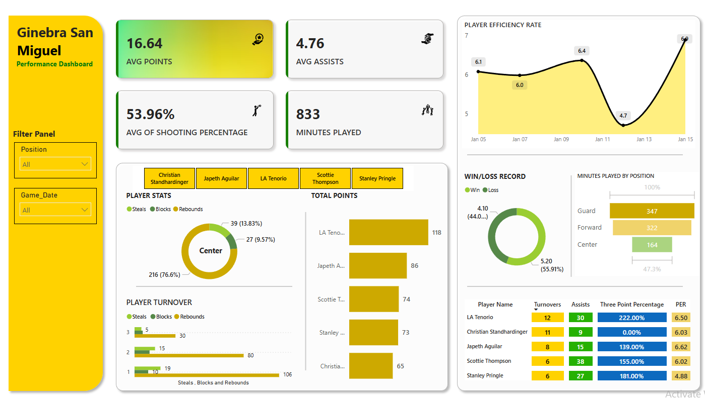

# 🏀 Barangay Ginebra Performance Analytics Dashboard

---

### 🚀 Dashboard Interaction

---

### **Project Goal & Overview**

This dashboard project provides a focused deep-dive into the performance statistics of the professional basketball team, **Barangay Ginebra San Miguel**. The goal is to apply advanced data analysis techniques to transform raw game data into clear, interactive visuals that drive strategic sports insights.

### **Solution: Interactive Power BI Dashboard**

Key Features:

**KPI Cards:** Instant view of high-level metrics (Points, Assists, Shooting %).

**Trend Analysis:** Line charts tracking Player Efficiency Rates over time.

**Interactive Slicers:** Dynamic filtering by 'Position' and 'Game Date' for deep-dive analysis.

**Tools Used:** Power BI, Excel (Data Source), Data Visualization.

### **🛠️ Technology Stack**

* **Primary Tool:** **Microsoft Power BI** (Used for comprehensive data modeling, calculated measures (DAX), and interactive report design.)
